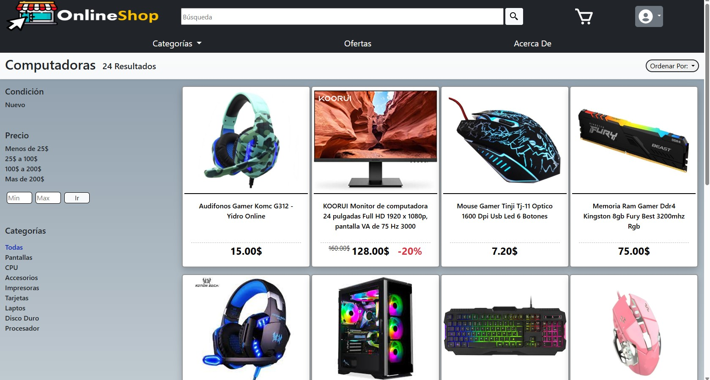
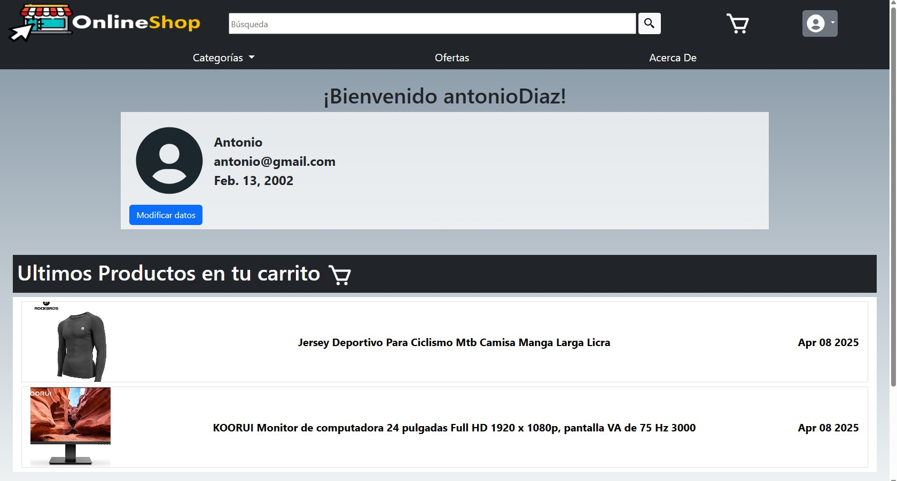

   

<h1 align="center">Online store project with cart</h1>

Practice project to learn how to use the Django framework, BootsTrap and MySql creating an online store.

## Run Locally

- RECOMMENDATION : Have Python 3.10.0 installed or use Conda as packages and environments.

1. Clone the repo to you local device.
2. Create a virtual environment with Python 3.10.0
3. Install the required packages by running `pip install -r requirements.txt` in your terminal.
4. Create the test database in mySQK`djanjoonlineshop.sql`
4. Run the application with `python manage.py runserver` in your terminal.
4. Open your browser and navigate to `http://127.0.0.1:8000/` to view th

### 🛠 &nbsp; Tools
- Django 
- BootsTrap 
- MySQL 

### Preview

 

 

 